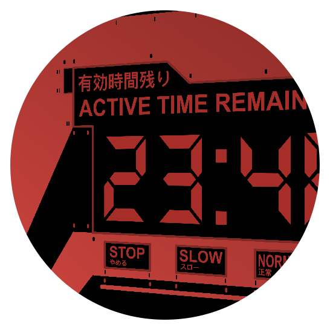

# Evangelion Clock Screensaver

A digital clock screensaver for mac inspired by the graphical interfaces from Neon Genesis Evengelion. It displays the time in hours, minutes and seconds and is available in two styles.

**Normal**

**Red**

Text from the Screensaver:

- 活動限界まで (Active Time Remaining)
- 内部 (Internal)
- 主エネルギー供給システム (Main Energy Supply System)
- やめる (Stop)
- スロー (Slow)
- 正常 (Normal)
- レース (Racing)

## Installation

1. Download the [latest version](https://github.com/Wandmalfarbe/evangelion-clock-screensaver/releases/latest) of the screensaver from the releases page.
2. Extract the ZIP file by double-clicking on it.
3. Install the screensaver by double-clicking on the file with the extension `.saver`.
4. A popup with the following text might appear:

    > “Evangelion Clock.saver” can’t be opened because it is from an unidentified developer.
    > Your security preferences allow installation of only apps from the App Store and identified developers.

    If this popup appears, proceed with step 5; Otherwise proceed with step 7.
5. Open *System Preferences* > *Security & Privacy* > *General* and click the *Open Anyway* button on the lower right of the settings window.
6. In the resulting Dialog click *Open*.
7. A popup with the following text appears:

    > The “Evangelion Clock” screen saver must be installed before you can use it. Do you want to install it now?
8. The first Option should be selected. Click *Install*.
9. You can find the screensaver by opening *System Preferences* > *Desktop & Screen Saver* > *Screen Saver*.

## Related

- [Simple Clock Screensaver](https://github.com/Wandmalfarbe/Simple-Clock-Screensaver) is an analogue clock screensaver for macOS written entirely in Swift. It has support for skins/themes (in source code only) and can be styled to match a wide variety of analogue wall clocks.

## Credits

- This screensaver contains code from [grid clock screensaver by Christopher Newton](https://github.com/chrstphrknwtn/grid-clock-screensaver).

## License

This project is open source licensed under the BSD 3-Clause License. Please see the [LICENSE file](LICENSE) for more information.
